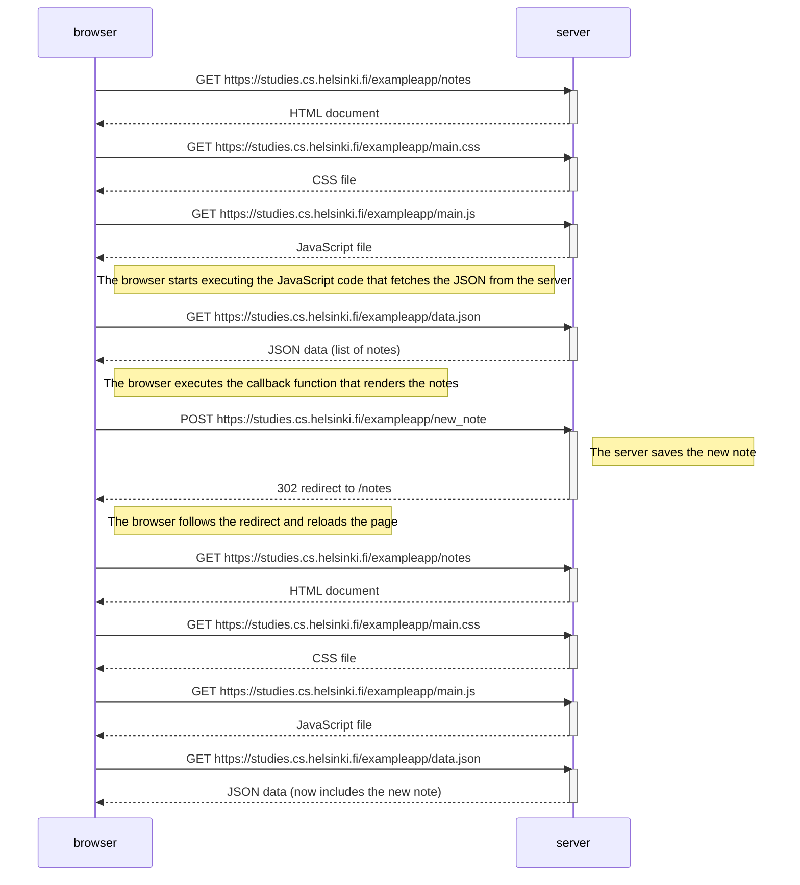

```mermaid

sequenceDiagram
  participant browser
  participant server

  browser->>server: GET https://studies.cs.helsinki.fi/exampleapp/notes
  activate server
  server-->>browser: HTML document
  deactivate server

  browser->>server: GET https://studies.cs.helsinki.fi/exampleapp/main.css
  activate server
  server-->>browser: CSS file
  deactivate server

  browser->>server: GET https://studies.cs.helsinki.fi/exampleapp/main.js
  activate server
  server-->>browser: JavaScript file
  deactivate server

  Note right of browser: The browser starts executing the JavaScript code that fetches the JSON from the server
  browser->>server: GET https://studies.cs.helsinki.fi/exampleapp/data.json
  activate server

  server-->>browser: JSON data (list of notes)
  deactivate server

  Note right of browser: The browser executes the callback function that renders the notes

  browser->>server: POST https://studies.cs.helsinki.fi/exampleapp/new_note
  activate server
  Note right of server: The server saves the new note
  server-->>browser: 302 redirect to /notes
  deactivate server

  Note right of browser: The browser follows the redirect and reloads the page

  browser->>server: GET https://studies.cs.helsinki.fi/exampleapp/notes
  activate server
  server-->>browser: HTML document
  deactivate server

  browser->>server: GET https://studies.cs.helsinki.fi/exampleapp/main.css
  activate server
  server-->>browser: CSS file
  deactivate server

  browser->>server: GET https://studies.cs.helsinki.fi/exampleapp/main.js
  activate server
  server-->>browser: JavaScript file
  deactivate server

  browser->>server: GET https://studies.cs.helsinki.fi/exampleapp/data.json
  activate server
  server-->>browser: JSON data (now includes the new note)
  deactivate server
```
